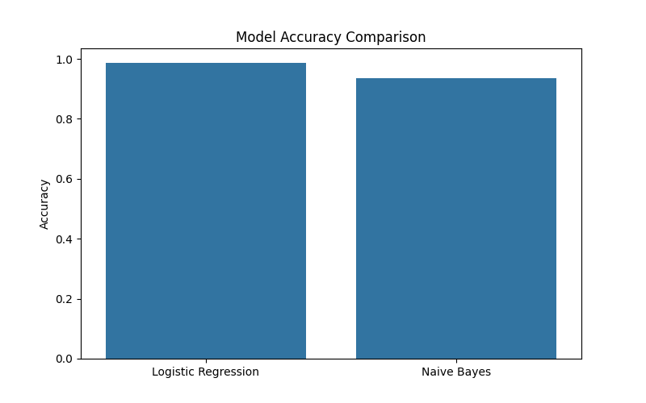

# Fake News Detection using Machine Learning

This project builds a machine learning model that can automatically classify news articles as **real or fake** using Natural Language Processing (NLP) techniques.

The goal of the project is to demonstrate how text data can be transformed into numerical features and used to train machine learning models for classification tasks.

---

## Project Overview

The spread of misinformation through online platforms has become a major global issue. Detecting fake news automatically using machine learning can help identify misleading content and improve information reliability.

In this project, we build a text classification pipeline that processes news articles and predicts whether the news is **fake or genuine**.

The workflow includes:

- Data loading and preprocessing
- Text feature extraction using TF-IDF
- Training multiple machine learning models
- Model evaluation and comparison
- Visualization of model performance

---

## Technologies Used

Python is used as the main programming language along with several data science libraries.

Libraries used in this project include:

- Pandas
- NumPy
- Matplotlib
- Seaborn
- Scikit-learn

---

## Dataset

The dataset contains real and fake news articles collected from multiple sources.

Each article contains:

- Title
- News content
- Label indicating whether the article is fake or real

Dataset source:

Kaggle – Fake and Real News Dataset

https://www.kaggle.com/datasets/clmentbisaillon/fake-and-real-news-dataset

The dataset consists of two files:

- Fake.csv
- True.csv

These datasets are merged during preprocessing and used for training the models.

---

## Machine Learning Models Used

Two machine learning algorithms are implemented and compared:

- Logistic Regression
- Multinomial Naive Bayes

Text data is converted into numerical features using **TF-IDF (Term Frequency–Inverse Document Frequency)** vectorization before training the models.

Model performance is evaluated using **accuracy scores**.

---

## Model Evaluation

The trained models are evaluated using a test dataset. The accuracy of each model is compared and visualized using a bar chart.

The visualization helps identify which model performs better for fake news classification.

---

## Visualization

### Model Accuracy Comparison

---

## Key Learning Outcomes

This project demonstrates:

- Text preprocessing for machine learning
- Feature extraction using TF-IDF
- Training machine learning classifiers
- Comparing model performance
- Visualizing results

---

## Future Improvements

Possible improvements for this project include:

- Using deep learning models such as LSTM or Transformers
- Hyperparameter tuning
- Cross-validation
- Deploying the model as a web application

---

## Author

Fasila Ansari

